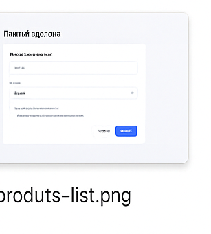
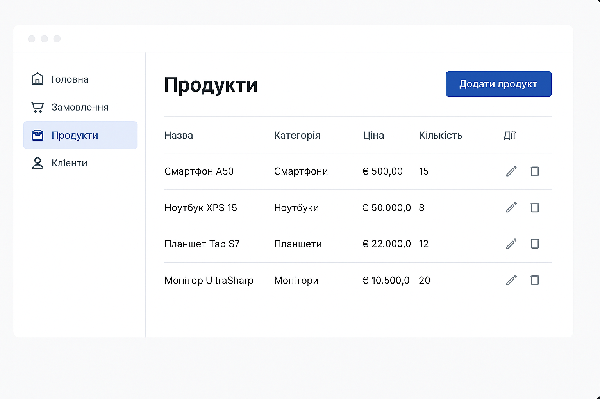

# Посібник користувача

## Вступ

Вітаємо у посібнику користувача інформаційної системи управління бізнес-діяльністю підприємства. Цей посібник призначений для допомоги користувачам у роботі з системою та містить детальні інструкції щодо використання різних функцій та модулів системи.

## Для кого призначений цей посібник

Цей посібник призначений для різних категорій користувачів системи:

- **Адміністратори** - відповідають за налаштування та управління системою
- **Менеджери** - керують замовленнями, клієнтами, товарами та фінансами
- **Співробітники** - працюють з замовленнями, клієнтами та товарами
- **Аналітики** - аналізують дані та формують звіти

## Структура посібника

Посібник розділений на наступні розділи:

1. [Початок роботи](./getting-started.md) - базова інформація про систему та початок роботи
2. [Управління замовленнями](./orders.md) - робота з замовленнями
3. [Управління клієнтами](./customers.md) - робота з клієнтами
4. [Управління товарами](./products.md) - робота з товарами
5. [Управління запасами](./inventory.md) - робота з товарними запасами
6. [Управління фінансами](./finance.md) - робота з фінансами
7. [Аналітика та звіти](./analytics.md) - робота з аналітикою та звітами
8. [Інтеграції](./integrations.md) - робота з інтеграціями
9. [Адміністрування](./administration.md) - адміністрування системи
10. [Часті питання](./faq.md) - відповіді на часті питання

## Початок роботи

### Вхід в систему

1. Відкрийте веб-браузер та перейдіть за адресою системи.
2. На сторінці входу введіть свій email та пароль.
3. Натисніть кнопку "Увійти".

### Головна сторінка

Після входу в систему ви побачите головну сторінку (дашборд), яка містить:

- Основні показники діяльності
- Останні замовлення
- Графіки продажів
- Сповіщення та нагадування

### Навігація

Для навігації по системі використовуйте бічне меню, яке містить наступні розділи:

- **Дашборд** - головна сторінка з основними показниками
- **Замовлення** - управління замовленнями
- **Клієнти** - управління клієнтами
- **Товари** - управління товарами
- **Запаси** - управління товарними запасами
- **Фінанси** - управління фінансами
- **Аналітика** - аналітика та звіти
- **Інтеграції** - управління інтеграціями
- **Налаштування** - налаштування системи

### Профіль користувача

Для доступу до свого профілю натисніть на своє ім'я у верхньому правому куті екрану. У профілі ви можете:

- Переглянути та редагувати свою інформацію
- Змінити пароль
- Налаштувати сповіщення
- Вийти з системи

## Управління замовленнями

### Перегляд списку замовлень

Для перегляду списку замовлень:

1. Перейдіть до розділу "Замовлення" у бічному меню.
2. Використовуйте фільтри для пошуку замовлень за статусом, датою, клієнтом тощо.
3. Натисніть на замовлення для перегляду детальної інформації.

### Створення нового замовлення

Для створення нового замовлення:

1. Перейдіть до розділу "Замовлення" у бічному меню.
2. Натисніть кнопку "Створити замовлення".
3. Виберіть клієнта або створіть нового.
4. Додайте товари до замовлення.
5. Вкажіть спосіб доставки та оплати.
6. Натисніть кнопку "Зберегти".

### Редагування замовлення

Для редагування замовлення:

1. Перейдіть до розділу "Замовлення" у бічному меню.
2. Знайдіть замовлення у списку та натисніть на нього.
3. Натисніть кнопку "Редагувати".
4. Внесіть необхідні зміни.
5. Натисніть кнопку "Зберегти".

### Зміна статусу замовлення

Для зміни статусу замовлення:

1. Перейдіть до розділу "Замовлення" у бічному меню.
2. Знайдіть замовлення у списку та натисніть на нього.
3. Натисніть на поточний статус замовлення.
4. Виберіть новий статус зі списку.
5. Натисніть кнопку "Зберегти".

### Створення експрес-накладної

Для створення експрес-накладної Nova Poshta:

1. Перейдіть до розділу "Замовлення" у бічному меню.
2. Знайдіть замовлення у списку та натисніть на нього.
3. Натисніть кнопку "Створити експрес-накладну".
4. Заповніть необхідні поля.
5. Натисніть кнопку "Створити".

## Управління клієнтами

### Перегляд списку клієнтів

Для перегляду списку клієнтів:

1. Перейдіть до розділу "Клієнти" у бічному меню.
2. Використовуйте фільтри для пошуку клієнтів за ім'ям, email, телефоном тощо.
3. Натисніть на клієнта для перегляду детальної інформації.

### Створення нового клієнта

Для створення нового клієнта:

1. Перейдіть до розділу "Клієнти" у бічному меню.
2. Натисніть кнопку "Створити клієнта".
3. Заповніть необхідні поля (ім'я, email, телефон тощо).
4. Натисніть кнопку "Зберегти".

### Редагування клієнта

Для редагування клієнта:

1. Перейдіть до розділу "Клієнти" у бічному меню.
2. Знайдіть клієнта у списку та натисніть на нього.
3. Натисніть кнопку "Редагувати".
4. Внесіть необхідні зміни.
5. Натисніть кнопку "Зберегти".

### Перегляд історії замовлень клієнта

Для перегляду історії замовлень клієнта:

1. Перейдіть до розділу "Клієнти" у бічному меню.
2. Знайдіть клієнта у списку та натисніть на нього.
3. Перейдіть на вкладку "Замовлення".

## Управління товарами

### Перегляд списку товарів

Для перегляду списку товарів:

1. Перейдіть до розділу "Товари" у бічному меню.
2. Використовуйте фільтри для пошуку товарів за назвою, категорією, артикулом тощо.
3. Натисніть на товар для перегляду детальної інформації.

### Створення нового товару

Для створення нового товару:

1. Перейдіть до розділу "Товари" у бічному меню.
2. Натисніть кнопку "Створити товар".
3. Заповніть необхідні поля (назва, категорія, ціна тощо).
4. Додайте зображення товару.
5. Натисніть кнопку "Зберегти".

### Редагування товару

Для редагування товару:

1. Перейдіть до розділу "Товари" у бічному меню.
2. Знайдіть товар у списку та натисніть на нього.
3. Натисніть кнопку "Редагувати".
4. Внесіть необхідні зміни.
5. Натисніть кнопку "Зберегти".

### Управління категоріями товарів

Для управління категоріями товарів:

1. Перейдіть до розділу "Товари" у бічному меню.
2. Натисніть на "Категорії" у підменю.
3. Для створення нової категорії натисніть кнопку "Створити категорію".
4. Для редагування категорії натисніть на категорію та виберіть "Редагувати".
5. Для видалення категорії натисніть на категорію та виберіть "Видалити".

## Управління запасами

### Перегляд запасів

Для перегляду запасів:

1. Перейдіть до розділу "Запаси" у бічному меню.
2. Використовуйте фільтри для пошуку товарів за назвою, категорією, артикулом тощо.
3. Натисніть на товар для перегляду детальної інформації про запаси.

### Додавання запасів

Для додавання запасів:

1. Перейдіть до розділу "Запаси" у бічному меню.
2. Натисніть кнопку "Додати запаси".
3. Виберіть товар.
4. Вкажіть кількість та склад.
5. Натисніть кнопку "Зберегти".

### Переміщення запасів

Для переміщення запасів між складами:

1. Перейдіть до розділу "Запаси" у бічному меню.
2. Натисніть кнопку "Переміщення".
3. Виберіть товар, кількість, склад-джерело та склад-призначення.
4. Натисніть кнопку "Зберегти".

### Інвентаризація

Для проведення інвентаризації:

1. Перейдіть до розділу "Запаси" у бічному меню.
2. Натисніть кнопку "Інвентаризація".
3. Виберіть склад.
4. Введіть фактичну кількість товарів.
5. Натисніть кнопку "Зберегти".

## Управління фінансами

### Перегляд транзакцій

Для перегляду фінансових транзакцій:

1. Перейдіть до розділу "Фінанси" у бічному меню.
2. Використовуйте фільтри для пошуку транзакцій за датою, типом, сумою тощо.
3. Натисніть на транзакцію для перегляду детальної інформації.

### Створення рахунку

Для створення рахунку:

1. Перейдіть до розділу "Фінанси" у бічному меню.
2. Натисніть на "Рахунки" у підменю.
3. Натисніть кнопку "Створити рахунок".
4. Виберіть клієнта та товари.
5. Вкажіть умови оплати.
6. Натисніть кнопку "Зберегти".

### Реєстрація платежу

Для реєстрації платежу:

1. Перейдіть до розділу "Фінанси" у бічному меню.
2. Натисніть на "Платежі" у підменю.
3. Натисніть кнопку "Додати платіж".
4. Виберіть клієнта та рахунок.
5. Вкажіть суму та метод оплати.
6. Натисніть кнопку "Зберегти".

### Фінансові звіти

Для перегляду фінансових звітів:

1. Перейдіть до розділу "Фінанси" у бічному меню.
2. Натисніть на "Звіти" у підменю.
3. Виберіть тип звіту (прибутки та збитки, баланс, рух коштів тощо).
4. Вкажіть період.
5. Натисніть кнопку "Сформувати".

## Аналітика та звіти

### Дашборди

Для перегляду аналітичних дашбордів:

1. Перейдіть до розділу "Аналітика" у бічному меню.
2. Виберіть дашборд зі списку.
3. Використовуйте фільтри для налаштування відображення даних.

### Звіти

Для формування звітів:

1. Перейдіть до розділу "Аналітика" у бічному меню.
2. Натисніть на "Звіти" у підменю.
3. Виберіть тип звіту.
4. Вкажіть параметри звіту.
5. Натисніть кнопку "Сформувати".

### Експорт даних

Для експорту даних:

1. Перейдіть до розділу "Аналітика" у бічному меню.
2. Натисніть на "Експорт" у підменю.
3. Виберіть тип даних для експорту.
4. Вкажіть формат експорту (CSV, Excel, PDF).
5. Натисніть кнопку "Експортувати".

## Інтеграції

### Nova Poshta

Для роботи з Nova Poshta:

1. Перейдіть до розділу "Інтеграції" у бічному меню.
2. Натисніть на "Nova Poshta" у підменю.
3. Для налаштування інтеграції натисніть кнопку "Налаштування".
4. Для створення експрес-накладної натисніть кнопку "Створити експрес-накладну".
5. Для відстеження відправлень натисніть кнопку "Відстеження".

### Rozetka

Для роботи з Rozetka:

1. Перейдіть до розділу "Інтеграції" у бічному меню.
2. Натисніть на "Rozetka" у підменю.
3. Для налаштування інтеграції натисніть кнопку "Налаштування".
4. Для синхронізації товарів натисніть кнопку "Синхронізувати товари".
5. Для імпорту замовлень натисніть кнопку "Імпортувати замовлення".

### Платіжні системи

Для роботи з платіжними системами:

1. Перейдіть до розділу "Інтеграції" у бічному меню.
2. Натисніть на "Платіжні системи" у підменю.
3. Для налаштування інтеграції натисніть кнопку "Налаштування".
4. Для перегляду транзакцій натисніть кнопку "Транзакції".

## Адміністрування

### Управління користувачами

Для управління користувачами:

1. Перейдіть до розділу "Налаштування" у бічному меню.
2. Натисніть на "Користувачі" у підменю.
3. Для створення нового користувача натисніть кнопку "Створити користувача".
4. Для редагування користувача натисніть на користувача та виберіть "Редагувати".
5. Для видалення користувача натисніть на користувача та виберіть "Видалити".

### Управління ролями

Для управління ролями:

1. Перейдіть до розділу "Налаштування" у бічному меню.
2. Натисніть на "Ролі" у підменю.
3. Для створення нової ролі натисніть кнопку "Створити роль".
4. Для редагування ролі натисніть на роль та виберіть "Редагувати".
5. Для видалення ролі натисніть на роль та виберіть "Видалити".

### Налаштування системи

Для налаштування системи:

1. Перейдіть до розділу "Налаштування" у бічному меню.
2. Натисніть на "Система" у підменю.
3. Налаштуйте параметри системи (назва компанії, логотип, валюта тощо).
4. Натисніть кнопку "Зберегти".

### Журнал подій

Для перегляду журналу подій:

1. Перейдіть до розділу "Налаштування" у бічному меню.
2. Натисніть на "Журнал подій" у підменю.
3. Використовуйте фільтри для пошуку подій за датою, типом, користувачем тощо.

## Часті питання

### Як змінити пароль?

Для зміни паролю:

1. Натисніть на своє ім'я у верхньому правому куті екрану.
2. Виберіть "Профіль".
3. Натисніть кнопку "Змінити пароль".
4. Введіть поточний пароль та новий пароль.
5. Натисніть кнопку "Зберегти".

### Як налаштувати сповіщення?

Для налаштування сповіщень:

1. Натисніть на своє ім'я у верхньому правому куті екрану.
2. Виберіть "Профіль".
3. Перейдіть на вкладку "Сповіщення".
4. Налаштуйте параметри сповіщень.
5. Натисніть кнопку "Зберегти".

### Як експортувати дані?

Для експорту даних:

1. Перейдіть до відповідного розділу (замовлення, клієнти, товари тощо).
2. Натисніть кнопку "Експорт".
3. Виберіть формат експорту (CSV, Excel, PDF).
4. Натисніть кнопку "Експортувати".

### Як імпортувати дані?

Для імпорту даних:

1. Перейдіть до відповідного розділу (замовлення, клієнти, товари тощо).
2. Натисніть кнопку "Імпорт".
3. Виберіть файл для імпорту.
4. Налаштуйте параметри імпорту.
5. Натисніть кнопку "Імпортувати".

## Підтримка

Якщо у вас виникли питання або проблеми при роботі з системою, зверніться до служби підтримки:

- Email: support@example.com
- Телефон: +380 (44) 123-45-67
- Чат: натисніть на іконку чату у нижньому правому куті екрану
